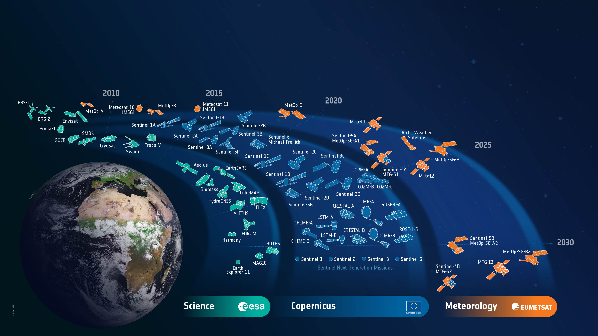
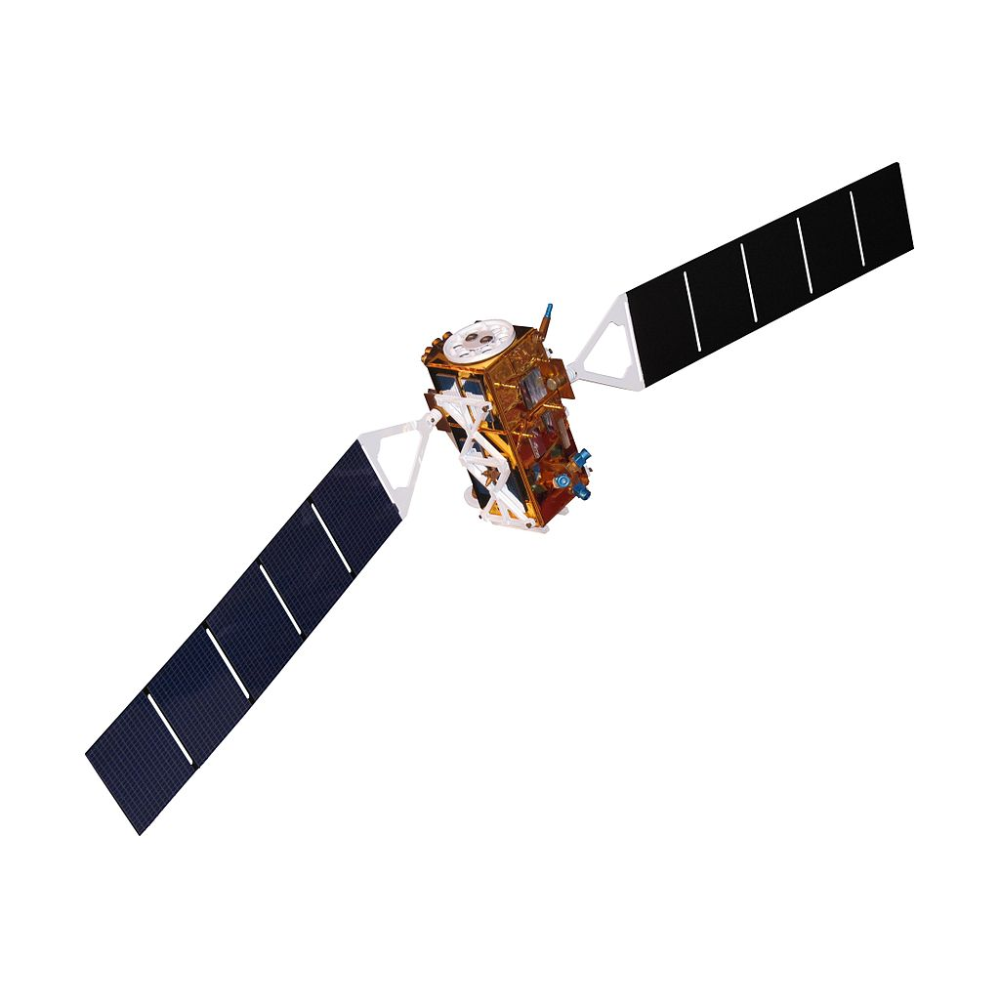
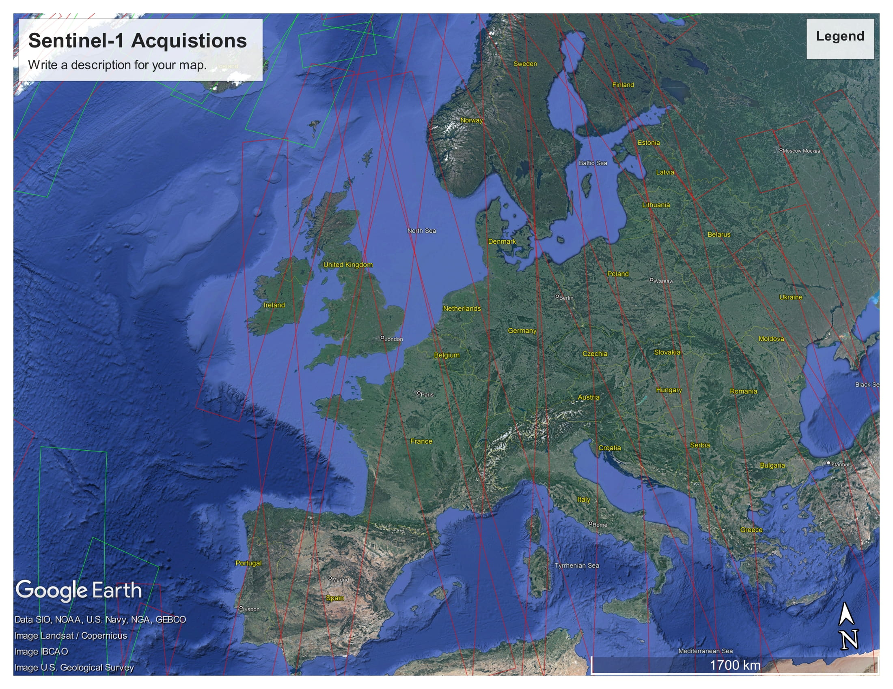
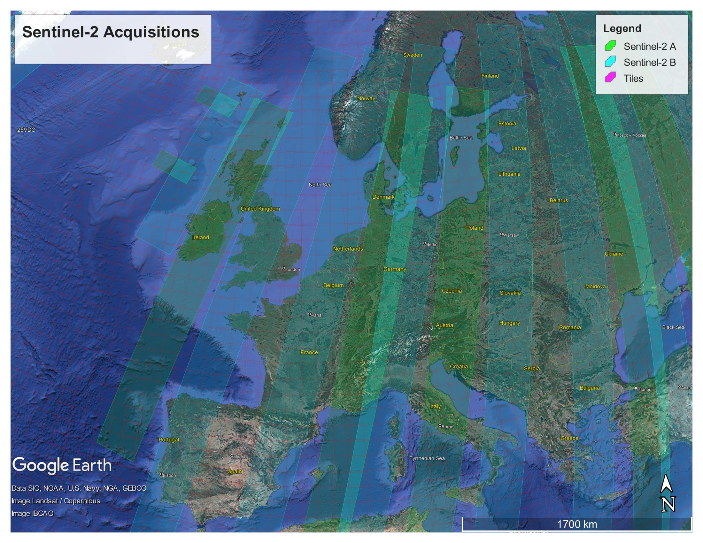
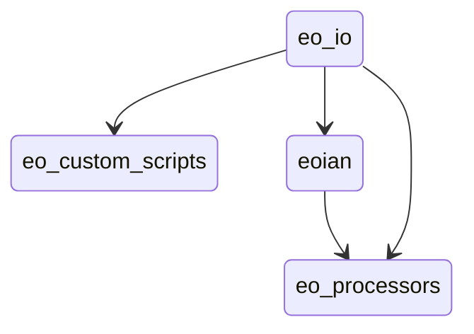
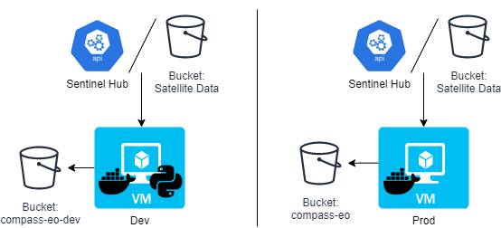
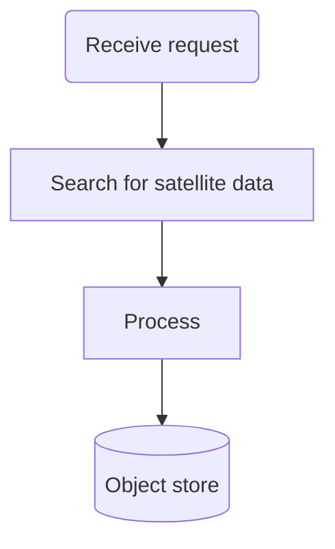
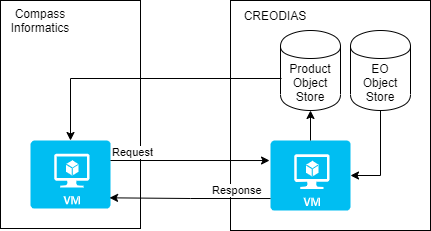
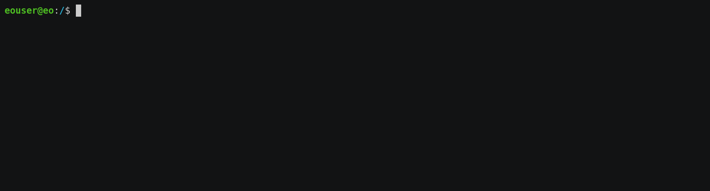
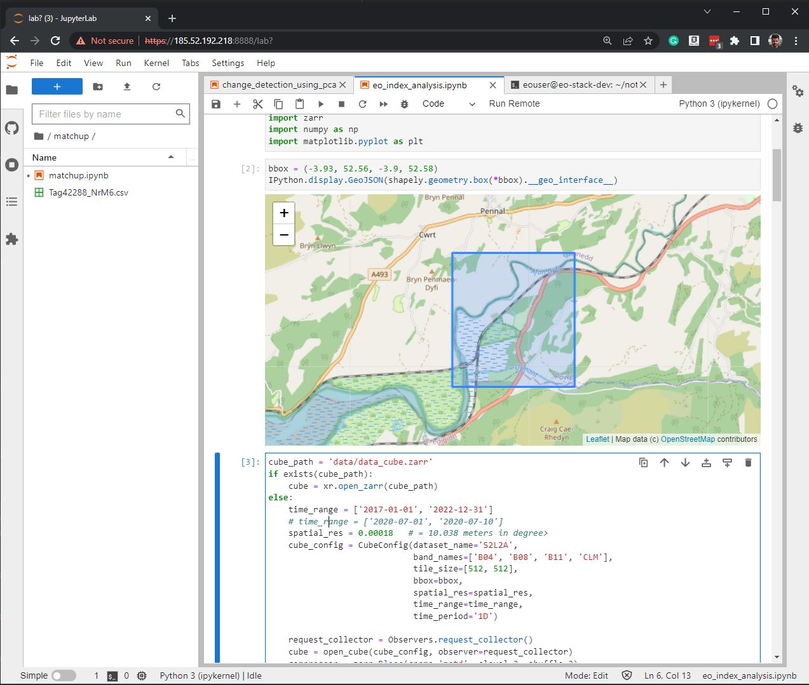

<h1>

</h1>

# The ECHOES Earth Observation Processing Service

***For the automation of satellite data processing in the processing in the cloud***

[The Sphinx-build version of this documentation is hosted by Compass Informatics](https://docs.compass.ie/EarthObservationDocs/)
.

The [ECHOES](https://echoesproj.eu/) Earth Observation Processing Service has been developed to automate the processing
of
Copernicus data, and provide an integrated environment for developing algorithms,
and analysing data.
The provisioning of the service is automated.

The Earth Observation (EO) Service, utilizes cloud platforms to enable fast access to EO data and flexible access to
processing power.
It provides Jupyter notebooks to prototype EO processing algorithms.
Ansible is used to automate the deployment and configuration of the service.

The EO Service runs the processing for a specified interval and Area Of Interest (AOI).
It does not provide scheduling of the EO processing itself;
the ECHOES web component does this with a program called eo-runner.

# Earth Observation Data

[Copernicus](https://www.copernicus.eu/) is the European Union's Earth observation programme.
The data collected by the Sentinel missions are free to access, for any use,
on [Copernicus Open Access Hub](https://scihub.copernicus.eu/).
[By year-end 2021, the data volume exceeded 30 PB, with a 7.5 PB/year rate if growth.](https://scihub.copernicus.eu/twiki/pub/SciHubWebPortal/AnnualReport2021/COPE-SERCO-RP-22-1312_-_Sentinel_Data_Access_Annual_Report_Y2021_merged_v1.1.pdf)
This rate is set to increase in the coming years as more Sentinel missions are commissioned.

<figure>
<a href="https://www.esa.int/ESA_Multimedia/Images/2019/05/ESA-developed_Earth_observation_missions">
</a>
<figcaption><b>© ESA, CC BY-SA 3.0 IGO</b> </figcaption>
</figure>

The Sentinels are a family of satellite missions, developed and launched by ESA,
which provide earth observation data as part of the Copernicus programme.
Each mission in the constellation is designed to fulfil revisit and coverage requirements.
They provide global coverage of robust and continous datasets for Copernicus services.
The data is provided free of charge,
enabling downstream (including commerical) services to be developed.

The missions carry a range of sensors, including for radar and multi-spectral imaging.
They are used for land, ocean and atmospheric monitoring.
The missions used in the ECHOES project are Sentinel-1 and -2.

## Sentinel-1

***A polar-orbiting Synthetic Aperture Radar (SAR) imaging mission, for both land and ocean monitoring.***

<figure>
<a href="https://sentinels.copernicus.eu/web/sentinel/missions/sentinel-1/overview">
</a>
<figcaption><b>Sentinel-1 (© ESA, CC BY-SA 3.0 IGO)</b></figcaption>
</figure>

The Sentinel-1 mission comprises two polar-orbiting satellites,
performing C-band Synthetic Aperture Radar (SAR) imaging.
Being an active instrument and operating at (cloud penetrating) C-band frequencies,
Sentinel-1 can operate data and night
and its measurements are not impacted by clouds
(as in the case for optical instruments).

Sentinel-1A was launched on 3 April 2014 and Sentinel-1B on 25 April 2016.
However, as of 2022, Sentinel-1B is non-operational, due to a power issue.
This reduces the temporal resolution of the mission by half,
until Sentinel-1C is launched.

Examples of thematic areas in which Sentinel-1 data are used are:

* monitoring land-surface for motion risks
* monitoring of surface water
* monitoring of polar sea-ice
* surveillance of the marine environment
* ship detection
* mapping for forest, water and soil management

[These KML files](https://sentinels.copernicus.eu/web/sentinel/missions/sentinel-1/observation-scenario/acquisition-segments)
provide detailed information about the planned Sentinel-1 acquisitions.
These files can be opened with Google Earth.

<figure>

<figcaption><b>
The Sentinel-1 acquisitions covering Europe, from 2022-11-20 12:00 AM to 2022-11-23 12:00 AM.
</b></figcaption>
</figure>

## Sentinel-2

***A polar-orbiting is a multispectral high-resolution imaging mission.***

<figure>
<a href="https://sentinels.copernicus.eu/web/sentinel/missions/sentinel-2/overview">
</a>
<figcaption><b>
Sentinel-2 (© ESA, CC BY-SA 3.0 IGO)
</b></figcaption>
</figure>

Sentinel-2A was launched on 23 June 2015, followed by Sentinel-2B on 7 March 2017.

Examples of thematic areas in which Sentinel-1 data are used are:

* Land monitoring
* Emergency management
* Climate change
* Maritime

Sentinel-2's instrument has 13 spectral bands:
four bands at 10 m, six bands at 20 m and three bands at 60 m spatial resolution.

| Sentinel-2 Bands              | Central Wavelength (µm) | Resolution (m) |
| ----------------------------- | ----------------------- | -------------- |
| Band 1 - Coastal aerosol      | 0.443                   | 60             |
| Band 2 - Blue                 | 0.49                    | 10             |
| Band 3 - Green                | 0.56                    | 10             |
| Band 4 - Red                  | 0.665                   | 10             |
| Band 5 - Vegetation Red Edge  | 0.705                   | 20             |
| Band 6 - Vegetation Red Edge  | 0.74                    | 20             |
| Band 7 - Vegetation Red Edge  | 0.783                   | 20             |
| Band 8 - NIR                  | 0.842                   | 10             |
| Band 8A - Vegetation Red Edge | 0.865                   | 20             |
| Band 9 - Water vapour         | 0.945                   | 60             |
| Band 10 - SWIR - Cirrus       | 1.375                   | 60             |
| Band 11 - SWIR                | 1.61                    | 20             |
| Band 12 - SWIR                | 2.19                    | 20             |

Like Sentinel-1, Sentinel-2 is a polar orbiting satellite.
It has an orbital swath width of 290 km.
Each Sentinel-2 product contains data covering a tile.
Each tile is 100 km × 100 km, with a 10 km overlap.
The tile covering Copenhagen, for example, is 33UUB.
The tiles do not directly correspond to the aquisition swaths.
The following figure shows the tiles and
[swaths](https://sentinels.copernicus.eu/web/sentinel/missions/sentinel-2/acquisition-plans) overlayed:

<figure>

<figcaption>
<b>The Sentinel-2 acquisitions covering Europe, from 2022-11-20 12:00 AM to 2022-11-23 12:00 AM.
The red grid boxes are the tile bounds.</b>
</figcaption>
</figure>

## Sentinel Product Files

Sentinel-1 and -2 can be downloaded from the [Copernicus Open Access Hub](https://scihub.copernicus.eu/)
in the Standard Archive Format (SAFE).
This format consists of a directory containing binary image data, and metadata in XML files.
The Sentinel-1 GRD products are around 1.7 GB.
The Sentinel-2 L1C and L2A products are around 600 MB and 800 MB respectively.

The files can be read and processed by software such as
[SNAP](https://step.esa.int/main/download/snap-download/) and
the Python library [Satpy](https://satpy.readthedocs.io).

# Cloud processing

Processing EO data in the cloud has a number of advantages
over processing on a local machine or an on-premises server.
Firstly, if the cloud provider provides access to the source EO data,
it may be retrieved from the object store more quickly
than downloading it from the Copernicus Open Access Hub.
This is especially true for older data,
which can take up to 24 hours to retrieve from the archive.

Other benifits in using a cloud provider to process satellite data include,
the ability to scale up the processing to multiple machines in a cost efficient way,
and access to the services that they provide (hosted database, serverless computing etc.)
which can help to make the processing more efficient.

## The DIAS cloud platforms

The DIAS (Data and Information Access Services) cloud-based platforms, funded by the European
Commission, was developed to facilitate and standardise the access to Copernicus data and information.
[CREODIAS](https://creodias.eu/) was chosen to host the EO Service for Compass Informatics.
The other DIAS platforms are Mundi, ONDA, WEkEO and Sobloo.
The DIAS systems provide access to EO Copernicus data.
The DIAS systems allow users to execute their applications in a cloud environment, and close to where data is stored.

[The following data is available on the CREODIAS](https://creodias.eu/data-offer): Sentinel-1 GRD, Sentinel-2,
Sentinel-3, new Sentinels (like 5P), ESA/Landsat, Envisat/Meris, full Sentinel-1 SLC for Europe and 6 months rolling
archive for Sentinel-1 SLC outside Europe and elements of Copernicus Services.

The data is accessible via an S3-compatible object store.
The object store holds over 30 PB of data.
It is possible to run Virtual Machine (VM) instances on a pay-per-use or fixed term basis.
The size of the virtual machines ranges from 1 (virtual) core and 1 GB of RAM to 24 cores and 496 GB or RAM. It is
possible to spin up multiple
instance if required for large-scale processing. The price list is found [here](https://creodias.eu/price-list).

## Sentinel Hub

[Sentinel Hub](https://www.sentinel-hub.com/) is a multi-spectral and multi-temporal, big data, satellite imagery
service.
It is used in the EO Service for accessing and processing Copernicus (and other) data.

Processed satellite imagery is accessed via APIs for the requested AOI and time range,
from the full archive, in a matter of seconds.
The processing is done on Sentinel Hub's servers.
The service is subscription-based, with a quota of "processing units" available to the user every month.

One of the reasons for selecting Sentinel Hub for use in the EO Service is the client application may request small
AOIs.
If the original satellite product (SAFE format data) were used,
it would require a large amount of data to be downloaded and processed;
whereas, the Sentinel API only return the data that is requested for the AOI.
Another selling point is that it has cloud-masking and moisacing built in for Sentinel-2 imagery.
Also, the processing is done on the Sentinel Hub servers,
so the processing can be scaled up without needing to be concerned about managing the infrastructure.

## Data Cubes

A further benefit of using Sentinel Hub is that the EO data can be accessed as a data cube using
[xcube](https://xcube.readthedocs.io/en/latest/),
and the [xcube_sh](https://github.com/dcs4cop/xcube-sh) plugin (which enables xcube to work via the Sentinel Hub API).
Data cubes provide convenient access to a time series of satellite images,
allowing computations across the time dimension, with raster alignment issues handled out of the box.
These datacubes are returned as [Xarray](https://docs.xarray.dev/en/stable/) objects.
Xarray is a powerful library for handling multidimensional arrays.
Xarray labels the dimensions and provides a convenient interface to select and apply operations to the data.
With Xarray, these operations can be applied to large datasets using multiple cores, using Dask.

The Ansible Playbook, used to provision the VMs, installs Juypter Lab on the development server
and also configures the VM so that xcube can be used in the Jupyter notebooks
(see [Provisioning the servers using Ansible](Provisioning-the-servers-using-Ansible])).

## A comparison of the options

Alternatives to Sentinel Hub/X-Cube data cubes include Open Data Cube (ODC) and OpenEO.
Sentinel Hub/X-Cube was chosen primarily because Sentinel Hub is used in ECHOES (i.e. in [eo-custom-scripts](#The-EO-Processing-Packages)) 
and, being a hosted service, it does not require additional infrastructure.
Whereas, to create a datacube with ODC to cover Ireland for one year,
for example, would require tens of terabytes of storage and a high-spec VM.

Both CREODIAS and Sentinel Hub provide access to Sentinel-1, Sentinel-2 L1C and L2A, Sentinel-3 OLCI and SLSTR,
Sentinel-5P, Landsat 8, 7 and 5, Envisat, MODIS and some Copernicus Services. The CREODIAS object store has some Level-2
products that are not available on Sentinel Hub.

|                         | CREODIAS Object Store                               |    Sentinel Hub                                                                                                                          |
|-------------------------|-----------------------------------------------------|----------------------------------------------------------------------------------------------------------------------------------------|
| Data Cap?               | No                                                  | Yes                                                                                                                                    | 
| Satellite Data Format   | The original format (e.g. SAFE for the Sentinel)    | Python interface and OGC                                                                                                               | 
| Processing              | Up to the user to do the processing using e.g. SNAP | Algorithms are implement in JavaScript. [A large number of existing algorithms are available](https://custom-scripts.sentinel-hub.com) | 
| Cloud Masking built in? | No                                                  | Yes including for Sentinel-2 L1C, L2A & Sentine-3 L1B                                                                                  | 
| Mosaicing built in?     | No                                                  | Yes including for Sentinel-2 L1C, L2A & Sentine-3 L1B                                                                                  | 
| Datacubes access?       | No                                                  | Yes for Sentinel-1, -2 & -3 (via X-Cube).                                                                                              | 

# The ECHOES Earth Observation Processing Service

The ECHOES EO Processing Service was developed to
generate GeoTIFFs and associated metadata, which are consumed by the web service.
It is designed to run in the cloud.
The ECHOES EO Service can consume data from the Sentinel Hub API or alternatively,
satellite data stored on and object store on CREODIAS, or other compatible cloud services.

The service is decoupled for the web service and can be used independently of it.
It is containerised for portability and scalability.
It is extendable, allowing other EO processors to be easily added.

A Command Line Interface (CLI) is provided for calling the EO processors.
The generated outputs (images, metadata, etc.) are stored in an S3 compatible object store.
These are accessed by the ECHOES web component for display to users.
The EO service is not reponsible for scheduling of the processing;
this is done by the web-component, with the eo-ruuner module.

The processing chains genarate GeoTIFFs (or other formats) and store them
(and associated metadata) in S3 compatiable object storage.

The code had been tested on CREODIAS.
CREODIAS' object store is compatible with AWS' S3 object store.
It should therefore be possible to run the code on AWS,
but this has not been tested at the time of writing.
When running locally, [Minio](https://min.io/) can be used to provide an S3 compatible, locally hosted, object store.

## The EO Processing Packages

This section give an overview of the Python code that has been developed to process the EO data.

The following diagram shows the main Python packages that have been developed
for EO service, with their dependencies:



### The lower-level packages

[eo-io](https://github.com/ECHOESProj/eo-io) is used to read and write to the S3 object store.
Both eo-custom-scripts and the processors in eo-processor read and write to the object store using the eo-io package.
eo-io is is a low-level package,
used by [eoian](https://github.com/ECHOESProj/eoian])
and [eo-processors](https://github.com/ECHOESProj/eo-processors),
to write the GeoTIFFs and metadata to S3.
S3 is the name of object storage service on AWS,
and a S3 compatible object store is available on CREODIAS.

[eoian](https://github.com/ECHOESProj/eoian]) is used to download,
process and store the satellite from the CREODIAS object store.
The processors, themselves are in the [eo-processors](https://github.com/ECHOESProj/eo-processors) repository.
This code is described in
[Processing of satellite files from the object store and other data sources](#processing-of-satellite-files-from-the-object-store-and-other-data-sources)
.

### The top-level packages

The processing chains are called remotely via webhooks
(see [Triggering the processing using webhook callbacks](#triggering-the-processing-using-webhook-callbacks)).
Webhook callbacks are used by the ECHOES web app to trigger the processing,
for the requested AOI and dates, over the internet.
The webhooks callback run the processing chains on the remote (CREODIAS) server, via CLIs.
The two repositorys with code which provide CLIs, for the processing chains,
and which may be called via the webhooks callback are:

* [eo-custom-scripts](https://github.com/ECHOESProj/eo-custom-scripts)
* [eo-processors](https://github.com/ECHOESProj/eo-processors)

Alternatively, the CLI may be called directly (i.e. without webhhooks) on the machine on which they are deployed,
as described in [The command line interface](#the-command-line-interface).

The eo-custom-scripts code (for which the EO processing is done on Sentinel Hub servers) has a single CLI,
from which many EO processors may be called
(see [Automation of the EO Custom Scripts repository](#automation-of-the-eo-custom-scripts-repo)).

The eo-processors code has a CLI for each processor
(
see [Processing of satellite files from the object store and other data sources](#processing-of-satellite-files-from-the-object-store-and-other-data-sources))
.
The processors consume EO data from various sources.
For example, from CREODIAS object store
(as is the case for eo-processors/eo_processors/ndvi_satpy,
where the eoian code is used to automate the downloading, processing and storage of the results).

## The system architecture

The following diagram gives an overview of the EO Service architecture for Compass Informatics:



There are two VMs: dev and prod (development and production respectively).
These are Ubuntu 20.04 (Focal Fossa) VMs, running on CREODIAS.
Each VM consumes data from either the Sentinel Hub or satellite data stored in buckets.
Each VM writes to a bucket, but on the dev server the bucket is named eo-compass-dev,
on the prod server the bucket is called eo-compass.

On the dev server, both the Docker containers and Python code is deployed to enable development.
On the prod server only the Docker containers are deployed.

Another difference betwween the two is that the Juypter Lab service is installed on the dev server,
but not prod.

Consult [the Playbook](https://github.com/ECHOESProj/eo-playbooks) used to provision both servers
to determine what is installed on each
(see [Provisioning the servers using Ansible](#Provisioning-the-servers-using-Ansible)).  

## Which processing chain should I use?

The [eo-custom-scripts](https://github.com/ECHOESProj/eo-custom-scripts)
processing chain (which uses Sentinel Hub) has a number of advantages over the eoain processing chain (which uses the
CREODIAS object store EO files).
It provides a convenient API for accessing and processing satellite data and it can provide clouding mosaicing.
Using the API, only the data within the AOI is processed on the Sentinel Hub server,
which makes the processing much faster for smaller regions.
This is in contrast to the eoain processing chain, in which the full granule is downloaded to the VM,
and it is not possible to just download the data within the AOI.

eo-custom-scripts is the main processing chain code used in the EO Service;
however, one case for using the eoian processing chain, in preference to eo-custom-scripts,
is where an algorithm implemented in [SNAP](https://step.esa.int/main/download/snap-download/) is required.
SNAP has many built-in algorithms which are not directly available in eo-custom-scripts.
For example, can SNAP carry out custom preprocesssing steps that are not available through Sentinel Hub, 
which can be automated using eoian 
(although Sentinel Hub does provide access to the Sentinel-2 L2A product, which is atmospherically corrected).
The eo-processors package (which uses the eoian package) allows for more flexibility to use other processing software,
including [SNAP](https://step.esa.int/main/download/snap-download/)
and [Satpy](https://satpy.readthedocs.io/).

Another case for using eo-processors and eoian, instead of eo-custom-scripts,
is where a very large area or large time period needs to be processed.
Sentinel Hub has a limited number
of [processing units](https://docs.sentinel-hub.com/api/latest/api/overview/processing-unit/) (which can be increased at
an additional cost).
Also, some EO data is available on the CREODIAS object store that is not available on Sentinel Hub.
For example, the Sentinel-3 Level-2 land and water products are not currently available on
Sentinel Hub (only the Level-1 product is available on Sentinel Hub, but both the Level-1 and Level-2 products are on
the
CREODIAS object store) and these may be required on the ECHOES application.
The eoian processing chain may be the best option for minimizing cost if processing a large area.

## Automation of the Sentinel Hub processing (eo-custom-scripts)

The [Sentinel Hub Customs Scripts repository](https://github.com/sentinel-hub/custom-scripts)
is a collection of scripts which implement EO processors.
[This repository](https://github.com/sentinel-hub/custom-scripts) is used to call these scripts, via a CLI.

With eo-custom-scripts, the processing is done on Sentinel Hub's servers.
Therefore, a low-spec VM can be used to run the code.

The figure below shows a chain block diagram for the eo-custom-scripts processing chain, which generates GeoTIFFs using
Sentinel Hub.
The diagram shows the code running on a VM on CREODIAS; however, it is not limited to running CREODIAS,
and it could run on, for example, AWS.
To run on other cloud platforms,
the credentials file needs to be modified (see [Handling the credentials](#handling-the-credentials])).


An S3, compatible object store is required,
but if one is not available, Minio can be used (see [Object Storage](#object-storage)).
The code calls the Sentinel Hub API.

The code in the [Sentinel Hub Customs Scripts repository](https://github.com/Sentinel-Hub/custom-scripts), has been
added to the eo-custom-scripts repository, so that the script can called via the command line. This enables many EO
products
can be quickly implemented on the ECHOES platform.

eo-processors and eo-custom-scripts can each be called by a CLI interface or imported as a Python module.
See the README of [eo-processors](https://github.com/ECHOESProj/eo-processors)
and [eo-custom-scripts](https://github.com/ECHOESProj/eo-custom-scripts)
for information on their installation and usage.

## Processing source satellite files with eoian

The Sentinel-1 and -2 data are stored in the SAFE format in the CREODIAS object store.
The [eoian](https://github.com/ECHOESProj/eoian) processing chain is used to automate the processing to this,
and other data, in the object store.

The eoian module the processing is done in the following sequence:



The program can be run using a CLI (as described in Section [The command line interface](#the-command-line-interface),
or if it is called remotely,
via webhooks (see [Calling the EO Service using webhooks](#calling-the-eo-service-using-webhooks)).

The command line or webhook call back arguments specify the name of the instrument,
processing module, the Area Of Interest (AOI) and other parameters.

This Python package is used to access satellite data from the data store,
process the data store it.

The processors that use the eoian package write the date to an object store
and write the location of the objects to the terminal,
which can be used download the results.



## The eo-processors repository

This [eo-processors](https://github.com/ECHOESProj/eo-processors) repository contains various processor.
The processors use the Eoian package, xcube libary and/or Sentinel Hub API to generate results.
The outputs of the processing chains are generally stored in the object store.
The processors that use the eoian package write the date to an object store
and write the location of the objects to the terminal.
See the README of each of the processors for information on their usage.

See [Processor Development](#Processor-Development) for information on how to add your own processors.

## Provisioning the servers using Ansible

Development of the EO processing chain can be done on a local or machine or a remote VM,
hosted by, for example, CREODIAS or AWS.

The setup of the EO dev environment can be time-consuming. It involves the following:

* install system packages
* install Python requirements
* copy keys over
* decrypt and copy credentials over
* set environment variables
* install Docker
* build Docker images
* Install JupyterLab

These steps are automated, using Ansible.

The ansible playbooks are in
the [eo-playbooks](https://github.com/ECHOESProj/eo-playbooks) repository.
See the README in the repository for the installation and usage instructions.


To run the code using Docker, copy the config files and GitHub key to the credentials directory, for example,
eo-custom-scripts\credentials.
This is required because Docker cannot access files outside its scope when building the image.
The files in the credentials' directory are copied to the home directory in the container.
It is not necessary to carry out these steps manually if you use Ansible. However, if you are doing them manually, refer
to the roles Ansible roles, which show the steps involved.

# Calling the EO service

## The command line interface

The EO Service is designed to be called via Webhooks, when running operationally.
It can also be called via the CLI on the production or development server,
where it is installed.

The first step is to login into the VM, with:

    ssh -i ~/.ssh/eo-stack.key eouser@<ip.of.vm>

The Ansible Playbook clones GitHub repositorys,
and saves the source code in the following directory:

    /home/eouser/echoes-deploy

### eo-custom-scripts

As an example, on the development machine, cd to

    /home/eouser/echoes-deploy/eo-custom-scripts

and run the eo-custom-scripts code by executing:

    python3 -m eo_custom_scripts sentinel2_l1c ndvi_greyscale "POLYGON((-6.377 52.344, -6.378 52.357, -6.355 52.357, -6.356 52.345, -6.377 52.344))" 

This runs the *ndvi_greyscale* process using Sentinel-2 L1C data (*sentinel2_l1c*)
for the AOI

    "POLYGON((-6.377 52.344, -6.378 52.357, -6.355 52.357, -6.356 52.345, -6.377 52.344)2019-01-01 2019-12-31)"

defined as a WKT,
from 2019-01-01 to 2019-12-31.
By default, monthly mosaics are generated.

As can been see here,
the GeoTIFFs and JSON metedata files generated by the processing are stored are returned on `stdout`:



These locations are parsed by eo-runner in the web component,
and downloaded from S3.

The following gives the usage instructions:

     python3 -m eo_custom_scripts -h

or consult the readme of the eo-custom-scripts repository.

### eo-processors

To run the eo-processors processors, on the development machine, cd to

    /home/eouser/echoes-deploy/eo_processors/

then run a processor.
For example, you can run the NDVI processor with:

    python3 ndvi_satpy S2_MSI_L1C "POLYGON((-6.485367 52.328206, -6.326752 52.328206, -6.326752 52.416241, -6.485367 52.416241, -6.485367 52.328206))" 2021-01-09 2021-02-01 --cloud_cover=90

As is the case for eo-custom-scripts,
the location of the generated files is returned on Stdout.

You can get usage instructions for the processors with:

    python3 ndvi_satpy -h

## Docker

Both eo-custom-scripts and eo-processors are containerised.
This ensures that the code runs uniformly and consistently on the host machine or container service.

To get the EO service up and running, it is necessary to build and run the websockets-server image and
eo-stack, in addition to handling the credentials.
The containers can be built as described in the README of these packages.
However, this is not necessary,
as checking out the code and building the containers, etc. is automated with an Ansible Playbook,
as descrided in [Provisioning the servers using Ansible](#Provisioning-the-servers-using-Ansible).

After the development machine has been provisioned (see [eo-playbooks](https://github.com/ECHOESProj/eo-playbooks)),
login into the terminal and list the container images available, as follows:

    vagrant@ubuntu-focal:~$ docker image list
    REPOSITORY          TAG            IMAGE ID       CREATED         SIZE
    eo-processors       latest         8bd2b6719048   2 days ago      1.99GB
    eo-custom-scripts   latest         9fb59b602664   2 days ago      1.44GB
    websockets-server   latest         5ea2a8fbc8fd   2 days ago      408MB

The *eo-custom-scripts* and *eo-processors* images are for EO processing,
and the *websockets-server* is for calling processing remotely, via webhooks.

The Ansible Playbook automates the building of the Docker images,
in addition to handling the credentials.
It is therefore *not* necessary to supply the credentials to the container,
or start the services using docker compose, as described bellow.
However, you may want to do this if you are, for example,
running the containers on your local machine.

### Supplying credentials to the container

When running the containers on the deployment or production machines,
the credentials stored in the eo-custom-scripts and eo-processors images.
The Ansible Playbook inserts the credentials into the config files (credentials/config_eo_service.yml)
of each of these packages, before building the images.
Therefore, it is not necessary to supply the credentials when running the container.

If the *eo-processors* and *eo-custom-scripts* images are built using

        docker build .

(i.e. without using the Playbook) the credentials files (*credentials/config_eo_service.yml*), in each of these
repositories,
is copied across to the image.
As these files do *not* contain the credentials,
the credentials will not be stored in the image.
However, the credentials can be passed in as enviroment variables when the container is run,
using the "--env-file" option.

The file */home/eouser/env_file* is created by the Ansible Playbook on the host machines.
If building and running the code in eo-custom-scripts and eo-processors,
without of the Playbook, create a file named env-file and add the following:

        PATH='/usr/local/sbin:/usr/local/bin:/usr/sbin:/usr/bin:/sbin:/bin:/usr/games:/usr/local/games:/snap/bin'
        SH_INSTANCE_ID=''
        SH_CLIENT_ID=''
        SH_CLIENT_SECRET=''
        WEBAPIKEY=''
        JUPYTER_NOTEBOOK_PASS=''
        CREODIAS_USERNAME=''
        CREODIAS_PASSWORD=''
        SERVICE='creodias'
        S3_ENDPOINT_URL_LOCAL='http://data.cloudferro.com'
        S3_ENDPOINT_URL_EXT='https://cf2.cloudferro.com:8080'
        S3_AWS_ACCESS_KEY_ID=''
        S3_AWS_SECRET_ACCESS_KEY=''
        CONFIG='null'
        BUCKET='' # Nane of bucket on S3

Add the appropriate credentials to this file.
Refer to the [eo-playbooks](https://github.com/ECHOESProj/eo-playbooks) repository
to understand what vales to set the variables to;
otherwise run the Playbook, which will generate it automatically and store it in

        /home/eouser/env_file.

### Running the container

The eo-stack repository contains the Docker Compose file
for starting the websockets server
(to call the EO Service remotely, using webhooks)
and to start the [Minio](https://min.io/) service for object storage.
(Minio is only used if the service is not running in a cloud
where an S3 object store is available.)
These services are intialised by executing

        docker compose up

in the eo-stack directory.

The Playbook does this automatically,
so you do not need to do this on the machine that have been provisioned using the Playbook.

Both eo-processors and eo-custom-scripts provide CLIs with which to run the processing,
as shown in the following examples:

    docker run --env-file=env_file --network host eo-custom-scripts copernicus_services global_surface_water_change "POLYGON((-6.3777351379394 52.344188690186, -6.3780784606933 52.357234954835, -6.3552474975585 52.357749938966, -6.3561058044433 52.345218658448, -6.3777351379394 52.344188690186))" 2015-01-01 2020-12-31
    docker run --env-file=env_file --network host eo-processors ndvi_satpy S2_MSI_L1C "POLYGON((-6.485367 52.328206, -6.326752 52.328206, -6.326752 52.416241, -6.485367 52.416241, -6.485367 52.328206))" 2021-01-09 2021-02-01 --cloud_cover=90

The *--network host* option enables the containers to communicate with
the services that have been started using docker compose.
In this case, the container is called with the environment file.
The *--network host* option is not necessary when running the containers on
the CREODIAS machines.

An alias is set in the .bashrc of the VM as follows:

    alias eo-run='docker run --env-file=/home/eouser/env_file -v /data:/data --network host'

which can the used call the container with the environment file automatically passed to the container
and the data directory on the container :

    eo-run eo-processors change_detection_s2_pca "POLYGON ((-6.485367 52.328206, -6.326752 52.328206, -6.326752 52.416241, -6.485367 52.416241, -6.485367 52.328206))" 2021-01-09 2021-02-01

See the readme in these repositories for usage instructions.

## Triggering the processing using webhook callbacks (websockets-server)

The [websockets-server](https://github.com/ECHOESProj/websockets-server) allows you
to remotely run the processing chains,
via the server IP address/domain name and WebSockets.
WebSockets allow a long living connection between server and client,
meaning it is ideal in a situation for a processing chain may be running for some hours.
The `websockets-server` is sent a docker container name and arguments,
and responds with the `stdout` or `stderr` of the container.
The `stdout` typically contains the location of the GeoTIFFs produced by the processing chain,
which can be then downloaded by the application which sent the websockets request.

Example using using JavaScript. Python has a pacakge called `websocket` which is useful if working with Python.
```javascript
// Create WebSocket connection.
const socket = new WebSocket('ws://localhost:3000?token=test_token');

// Connection opened
socket.addEventListener('open', function (event) {
    socket.send(JSON.stringify({
        image: 'eo-custom-scripts',
        instrument: 'S2_MSI_L1C',
        processing_module: 'ndvi_s2',
        polygon: 'POLYGON ((-6.485367 52.328206, -6.326752 52.328206, -6.326752 52.416241, -6.485367 52.416241, -6.485367 52.328206))',
        start: '2021-01-10',
        stop: '2021-01-11',
        optional: {
            '--cloud_cover': 90 
        }                       
    }));
});

// Listen for messages
socket.addEventListener('message', function (event) {
    console.log(JSON.parse(event.data));
});
```


# Jupyter Lab

The Ansible Playbook installs Jupyter Lab.

JupyterLab is used to prototype EO processors, before being added to the processing chain.
It is installed by the Ansible Playbook (
see [Automation of the EO Custom Scripts repo](#automation-of-the-eo-custom-scripts-repo))



The Anisble Playbook installs JupyterLab on the remote machine.
It can be accessed via

    https://<ip of remote machine>:8888.

The eo-io, eoian and eo-processors packages may be imported in the notebooks.

The Playbook sets environment variables,
so that the data may be accessed as datacubes,
via the xcube interface, or from Sentinel Hub directly.

If the VM is running on CREODIAS, the Copernicus, and other EO data is accessible on /eodata/ via the Jupyter Lab
notebooks.

## Binding ports

Dask is a package for parallel computing that can be used to reduce the processing time.
The Dask distributed scheduler provides an interactive dashboard,
containing plots and tables with live information,
for live feedback on the processing.

The dashboard is accessible through the browser, on a specified port.
In order to access the dashboard, this port on the remote VM can be bound to your local machine.
In order to do this, execute the following:

    ssh -i ~/.ssh/eo-stack.key -N -L 9999:localhost:7744 eouser@<ip-of-remote-server> &

in the web browser of your local machine goto:

    http://127.0.0.1:9999

in order to access the dashboard.

## Binder notebooks

Binder is used to open notebooks in an executable environment.
Whereas Jupyter Lab is a private developement environment,
Binder notebooks are public and provide a way of interacting with the notebooks.
[This Binder Notebook](https://mybinder.org/v2/gh/ECHOESProj/eo-notebooks/main)
show how NDVI can be analysed using Xarray.

## Processor Development

## eo-custom-scripts

New processors can be added to eo-custom-scripts by modifying the source code.
The processors are located here:

    eo-custom-scripts/eo_custom_scripts/custom_scripts

Add the processor to the directory corresponding to the instrument that the processor will use.
Add a directory with the name of the processor to the directory with the existing processors.
In that directory add the processor and name it script "script.js".
The script can the be called via the CLI.

## eo-processors, eoian & eo-io

### Example: create a processing chain using eoin

The processor in eo-processors/eo_processors/ndvi_satpy generates Sentinel 2 NDVI GeoTIFFs.
The following example creates an NDVI product (without the CLI).

```python3
from os.path import dirname
from satpy import Scene, find_files_and_readers
from shapely import wkt
from eoian import ProcessingChain, utils
import xarray as xr


def main(input_file: str, area_wkt: str) -> xr.Dataset:
    files = find_files_and_readers(base_dir=dirname(input_file), reader='msi_safe')
    scn = Scene(filenames=files)
    scn.load(['B04', 'B08'])
    area = wkt.loads(area_wkt)

    epsg = scn['B04'].area.crs.to_epsg()
    xy_bbox = utils.get_bounds(area, epsg)
    scn = scn.crop(xy_bbox=xy_bbox)

    extents = scn.finest_area().area_extent_ll
    ad = utils.area_def(extents, 0.0001)
    s = scn.resample(ad)

    ndvi = (s['B08'] - s['B04']) / (s['B08'] + s['B04'])
    s['ndvi'] = ndvi
    s['ndvi'].attrs['area'] = s['B08'].attrs['area']
    del s['B04']
    del s['B08']
    return s


instrument = "S2_MSI_L1C"
area_wkt = "POLYGON((-6.485367 52.328206, -6.326752 52.328206, -6.326752 52.416241, -6.485367 52.416241, -6.485367 52.328206))"
start, stop = "2021-01-09", "2021-02-01"

processing_chain = ProcessingChain(instrument,
                                   area_wkt,
                                   start,
                                   stop,
                                   processing_func=main)

for result in processing_chain:
    result.to_tiff()
    result.metadata_to_json()
```

The *main* function implements the procesor and returns a Xarray dataset with the results.
The main function is an argument of the *ProcessingChain* class.
The for-loop interates over the *processing_chain* object,
which yields a result object.
The result object contains the processed dataset and methods to write write to the object store.
The methods include:

* *to_tiff()*
* *to_zarr()* (experimental)
* *metadata_to_json()*

### Example: writing to the object store using eo_io

The eo_io module is used to write the data to the datastore.

```python3
import eo_io


@dataclass
class Metadata(eo_io.metadata.BaseMetadata):
    area_wkt: str
    name: str
    platform: str
    instrument: str
    processingLevel: str
    date1: str
    date2: str


def get_path(self):
    return join(self.area_wkt, self.name, self.platform, self.instrument, self.processingLevel,
                f'{self.date1}_{self.date2}')


def compute_dataset() -> xr.Dataset:
    """processing code goes here"""
    return ds


dataset = compute_dataset()
metadata = Metadata(area_wkt, 'change', 'sentinel2', 'msi', 'S2L2A', date1, date2)

store = eo_io.store_dataset.store(dataset, metadata)
store.to_tiff()
```

# The eo-tracking-matchup repository

The [eo-tracking-matchup repository](https://github.com/ECHOESProj/eo-tracking-matchup)
is a standalone package for obtaining the cloest EO values for each coordinate in a CSV file.

It has been used to matchup Sentinel-2 NDMI values to a timeseries of bird tracking values.

Usage instructions are given in the readme.
It will be necessary to modify the code to adapt it to the format or your CSV file,
and to obtain other variables, other than NDMI.

# Acknowledgements

This software was developed by [Compass Information](https://compass.ie),
as part of the [ECHOES project](https://echoesproj.eu/).

The ECHOES project is funded by [an Irish Welsh Programme](https://irelandwales.eu),
which promotes co-operation in the areas of innovation, climate change and sustainable development.
It is part-funded by the 2014-2020 European Regional Development Fund,
through the Welsh Government.
