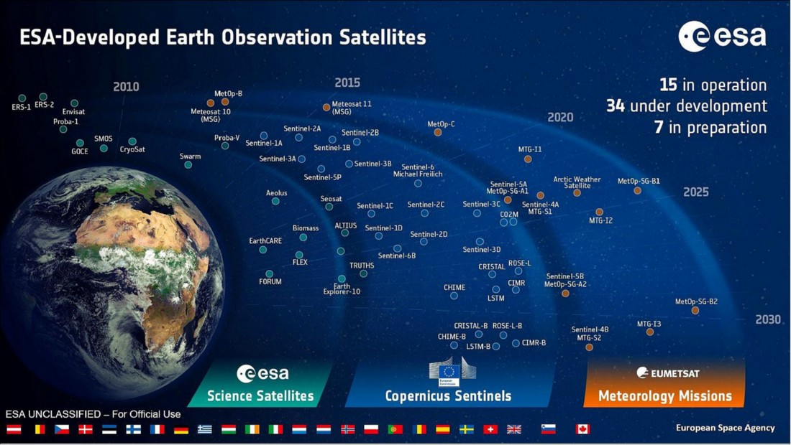
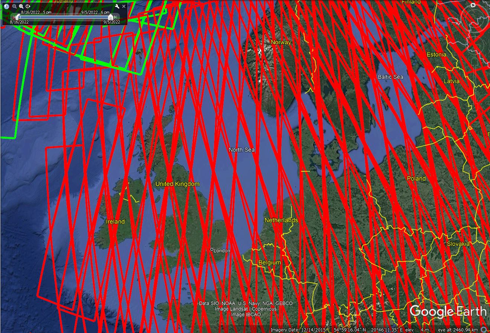
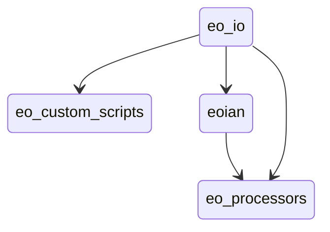
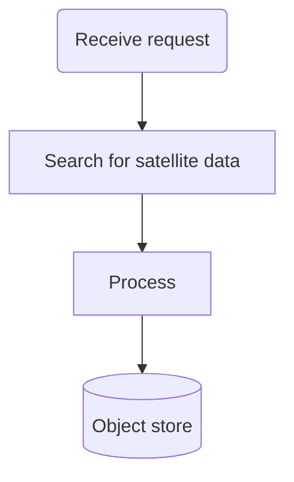

# The ECHOES Earth Observation Processing Service  

* Develop Earth Observation Algorithms 
* Automate the processing 
* Process in the Cloud

The ECHOES Earth Observation Processing Service has be developed to automate the processing of
Copernicus data and provide an integrated environment for developing algorithms.

It comprises Python packages to download and process satellite data.
It utilizes cloud platforms to enable fast access to EO data and flexible access to processing power.
The service provides Jupyter notebooks to prototype EO processing algorithms.
The services involve a number of steps to provision, and Ansible is used to automate this.

## This Document

This is the high-level documentation for the ECHOES Project code.

To view this documentation in a browser, install [docsify](https://docsify.js.org/), cd to the eo-docs directory, and
enter the command:

    docsify serve

# Quick start

## Earth Observation Data

Copernicus is the European Union's Earth observation programme.
The data collected by the Sentinel missions are free to access, for any use, on Open Hub.
By year-end 2020, the data volume totaled 24.87 PiB, with 7.65 PiB published in 2020 alone.
The rate of increase in Earth Observation (EO) data volume is set to increase in the coming years as more Sentinel
missions come online.

<figure>

<figcaption align = "center"><b>© ESA, CC BY-SA 3.0 IGO</b></figcaption>
</figure>

Sentinel-1 and -2 can be downloaded from the [Copernicus Open Access Hub](https://scihub.copernicus.eu/) 
in the Standard Archive Format (SAFE). 
This format consists of a folder containing the image data in a binary data format and product metadata in XML. 
The Sentinel-1 GRD products are around 1.7 GB. 
The Sentinel-2 L1C and L2A products are around 600 MB and 800 MB respectively.

  

    
  

  

    
  

Each Sentinel-2 product contains data covering a tile (also called a granule).
The tile grid is available for download in the .kml format and opened in Google Earth.

Each tile is 100 km×100 km, with a 10 km overlap. 
The tile covering Copenhagen, for example, is 33UUB.

## Cloud processing

Processing EO data in the cloud has a number of advantages over processing on a local machine or in-house server.

#### CREODIAS

Firstly, if the cloud provider provides access to the source EO data, 
it may be accessed much more efficiently than downloading it from the Copernicus Open Access Hub.
Other advantages in using a cloud provider include, scalability

The DIAS (Data and Information access services) cloud-based platforms, funded by the European
Commission, developed to facilitate and standardise the access to Copernicus data and information. 
The other DIAS platforms are Mundi, ONDA, WEkEO and Sobloo. 
The DIAS systems provide access to EO Copernicus data. 
The DIAS systems allow users to execute their applications in a cloud environment, and close to where data is stored. 
At Compass we are using CREODIAS, but the code can is not tied to a particular platform. 

The following data is available on the CREODIAS (see https://creodias.eu/data-offer): Sentinel-1 GRD, Sentinel-2,
Sentinel-3, new Sentinels (like 5P), ESA/Landsat, Envisat/Meris, full Sentinel-1 SLC for Europe and 6 months rolling
archive for Sentinel-1 SLC outside Europe and elements of Copernicus Services.

The data is accessible via an S3-compatible object store. The object store holds over 20 PB of data.
It is possible to run Virtual Machine (VM) instances on a pay-per-use or fixed term basis. The size of the virtual
machines range from 1 (virtual) core and 1 GB of RAM to 24 cores and 496 GB or RAM. It is possible to spin up multiple
instance if required for large-scale processing. The price list is found here: https://creodias.eu/price-list.

#### Sentinel Hub

[Sentinel Hub](https://www.sentinel-hub.com/) is a multi-spectral and multi-temporal big data satellite imagery service.
Users can use APIs to retrieve satellite data over their AOI and specific time range from full archives in a matter of
seconds.

An additional benefit of using Sentinel Hub is that the EO data can be accessed as a data cube using X-Cube. 
Data cubes provide convenient access to a time series of satellite images, 
allowing computations across the time dimension, with raster alignment issues handled out of the box. 
Data cubes will be used to provide information about changes over time and space.

Alternatives to Sentinel Hub/X-Cube data cubes include Open Data Cube (ODC) and OpenEO. 
Sentinel Hub/X-Cube was chosen primarily because Sentinel Hub is used in ECHOES (i.e. in eo-custom-scripts) and, 
being a hosted service, it does not require additional infrastructure.   

#### Comparison

Both CREODIAS provide access to Sentinel-1, Sentinel-2 L1C and L2A, Sentinel-3 OLCI and SLSTR, Sentinel-5P, Landsat 8, 7 and 5, Envisat, MODIS and some Copernicus Services. The CREODIAS object store has some Level-2 products that are not available on Sentinel-Hub. 

|                        | CREODIAS Object Store | 	Sentinel-Hub             |
|------------------------|-----------------------|---------------------------|
| Data Cap?              | No                    | Yes                       | 
| Satellited Data Format | The original format (e.g. SAFE for the Sentinel | Python Interface and OGC  | 
| Processing             | Up to the user to do the processing using e.g. SNAP  |  Algorithms are implement in JavaScript. A large number of existing algorithms are available on https://custom-scripts.sentinel-hub.com.  | 
| Cloud Masking built in?| No                      |  Yes including for Sentinel-2 L1C, L2A & Sentine-3 L1B  | 
| Mosaicing built in?    | No                      |  Yes including for Sentinel-2 L1C, L2A & Sentine-3 L1B  | 
| Datacubes access?      | No                      |  Yes for Sentinel-1, -2 & -3 (via X-Cube).              | 

The eo-custom-scripts processing chain (which uses Sentinel-Hub) has a number of advantages over the eoain processing chain (which uses the CREODIAS object store EO files). 
It provides a convenient API for accessing and processing satellite data and has clouding mosaicing. 
Using the API, only the data within the AOI is processed on the Sentinel-Hub server, 
which makes the processing much faster for smaller regions. This is in contrast to the eoain processing chain, in which the full granule is downloaded to the VM and it is not possible to just download the data within the AOI. 

The eo-custom-scripts processing chain will generally be used in preference to the eoain processing chain; 
however, one case for using the eoian processing chain, instead of eo-custom-scripts, 
is where an algorithm implemented in SNAP [11] is required. 
SNAP has many built-in algorithms which are not directly available in eo-custom-scripts. 
For example, SNAP implements atmospheric correction algorithms that are not available through Sentinel Hub, which can be automated using eoian. In the case where collaborators from other institutions in the ECHOES project implement there processing using SNAP, the eoain processing chain will be used to automate it. Another case for using eoian in place of eo-custom-scripts is where a very large area or large time period needs to be processed. Sentinel Hub has a limited data allowance (which can be increased at an additional cost); however, this has not been an issue so far. Also, some EO data is available on the CREODIAS object store that is not available on Sentinel-Hub. For example, the Sentinel-3 Level-2 land and water products are not currently available on Sentinel Hub (only the Level-1 product is available on Sentinel-Hub but both the Level-1 and Level-2 products are on the CREODIAS object store) and these may be required on the ECHOES platform.  

## Satellite Data Processing Tools

The satellite products come in a large variety of formats and there are many options for processing satellite data. The
challenge is to learn how to access, process, and store the data. Here are the tools that are most important to me:
* SNAP (desktop software)
* Sentinel Hub (API for satellite data)
* Satpy (Python library)
* GDAL

# Introduction to the ECHOES Earth Observation Processing Service 

The challange is to...

The ECHOES Earth Observation (EO) Processing Service has been developed to
generate GeoTIFFs and associated metadata, which are consumed by the web service.
It is designed to run in the cloud.

  

The EO service can consume data from the Sentinel-Hub API or alternatively,
satellite data stored on and object store on CREODIAS, or other compatible cloud services.

The EO service is decoupled for the web service and can be used independently of it.
It is containerised for portability and scalability.
It is extendable, allowing further EO processors to be easily added.

The EO service provides CLI for calling the EO processors.
The generated outputs (images, metadata, etc.) are stored in an S3 compatible object store.
These are accessed by the ECHOES UI component for display to users. 
The EO service does not do the scheduling of the processing; this is done by eo-ruuner. 

The processing chains have been developed to run in the cloud. 
Advantages of using cloud services, such as Creodias and AWS, include:
* they can take advantage of the satellite data available there
* the size of the VMs can be increased or decreased as required

The processing chains generally genarate GeoTIFFs and store them 
(and associated metadata) in S3 compatiable object storage.

When running locally, [Minio](https://min.io/) can be used to provide an S3 compatible, locally hosted, object store.

# The EO Processing Packages

This section outlines the Python code that has been developed to process the EO data.
The code is used to process satellite data and the resulting output (generally GeoTIFFs) are stored in an object store.

The processing chains are called remotely via webhooks 
(see [Triggering the processing using webhook callbacks](#triggering-the-processing-using-webhook-callbacks)).
Webhook callbacks are used by the ECHOES web app to trigger the processing, 
for the requested ROI and dates, over the internet.
The webhooks callback run the processing chains on the remote (CREODIAS) server, via CLIs.
The two repos with code which provide CLIs, for the processing chains,
and which may be called via the webhooks callback are:
* [eo-custom-scripts](https://github.com/ECHOESProj/eo-custom-scripts)
* [eo-processors](https://github.com/ECHOESProj/eo-processors)

Alternatively, the CLI may be called directly (i.e. without webhhooks) on the machine on which they are deployed, 
as described in [The command line interface](#the-command-line-interface).

The eo-custom-scripts code (for which the EO processing is done on Sentinel Hub servers) has a single CLI,
from which many EO processors may be called
(see [Automation of the EO Custom Scripts repo](#automation-of-the-eo-custom-scripts-repo)).

The eo-processors code has a CLI for each processor
(see [Processing of satellite files from the object store and other data sources](#processing-of-satellite-files-from-the-object-store-and-other-data-sources)). 
The processors consume EO data from various sources.
Some of the processors consume data from CREODIAS object store (for example eo-processors/eo_processors/ndvi_satpy).
In this case, the eoian code is used to automate the downloading, processing and storage of the results.
 
The following Python packages are used for EO processing in ECHOES and their dependencies:

[eoian](https://github.com/ECHOESProj/eoian]) is used to download, process and store the satellite from the CREODIAS object store.
The processors, themselves are in the [eo-processors](https://github.com/ECHOESProj/eo-processors) repo.
This code is described in [Processing of satellite files from the object store and other data sources](#processing-of-satellite-files-from-the-object-store-and-other-data-sources). 

[eo-io](https://github.com/ECHOESProj/eo-io) is used to interface to the S3 object store.
Both eo-custom-scripts and the processors in eo-processor read and write to the object store using the eo-io package.
It is a lower level module, used by the other packages,
to write the GeoTIFFs and metadata to S3.
eo-io is used by [eoian](https://github.com/ECHOESProj/eoian]) 
and [eo-processors](https://github.com/ECHOESProj/eo-processors) to store the results in S3. S3 is available on AWS and an S3
compatible object store is available on CREODIAS.

## Automation of the EO Custom Scripts repo

The code in the Sentinel-Hub Customs Scripts repository, https://github.com/sentinel-hub/custom-scripts, 
has been added to the eo-custom-scripts repository, so that the script can be called via the command line. 
This means that many EO products can be quickly implemented on the ECHOES platform. 

With eo-custom-scripts, the processing is done on Sentinel-Hub's servers, whereas with eoian the processing is done locally. 
Therefore, the machine requirements may be greater for the processors in eo-processors, 
depending on the processing.

The figure below shows a chain block diagram for the eo-custom-scripts processing chain, which generates GeoTIFFs using Sentinel-Hub. 
The diagram shows the code running on a VM on CREODIAS; however, it is not limited to CREODIAS,
and cloud, for example, run on AWS. 
To run on other cloud platforms, the credentials' file needs to be modified (see [Handling the credentials](#handling-the-credentials])). 

An S3, compatible object store is required, 
but if one is not available, Minio can be used (see [Object Storage](#object-storage)). 
The code calls the Sentinel Hub API. The algorithm is implemented in JavaScript.

The code in the [Sentinel-Hub Customs Scripts repository](https://github.com/sentinel-hub/custom-scripts), has been
added to the eo-custom-scripts repository, so that the script can called via the command line. This enables many EO products
can be quickly implemented on the ECHOES platform.

eo-processors and eo-custom-scripts can each be called by a CLI interface or imported as a Python module. 
See the README of [eo-processors](https://github.com/ECHOESProj/eo-processors) and [eo-custom-scripts](https://github.com/ECHOESProj/eo-custom-scripts)
for information on their installation and usage. 

## Processing of satellite files from the object store and other data sources

[eoian](https://github.com/ECHOESProj/eoian)

Examples of the code usage are given in the eo-processors repo see [eo-processors](#eo-processors). 

eoian is used to process satellite data for the store (e.g. in the SAFE format for Sentinel-2 data).

The following flowchart shows the steps involved:

The eoian module is imported and the  

The program can be run using a CLI (as described in Section [The command line interface](#the-command-line-interface),
or if it is called remotely, 
via webhooks (see [Calling the EO Service using webhooks](#calling-the-eo-service-using-webhooks))).

The command line  or webhook call back arguments specifiy the name of the instrument, the Area Of Interest (AOI),

This Python package is used to access satellite data from the data store, 
process the data store it.

The processors that use the eoian package write the date to an object store
and write the location of the objects to the terminal, 
which can be used download the results.

### Processors Repo

[eo-processors](https://github.com/ECHOESProj/eo-processors)

This package contains a collection of EO processors. 
The processors use the Eoian package, xcube libary or Sentinel Hub API to generate results.
The outputs of the processing chains are generally stored in the object store. 
The processors that use the eoian package write the date to an object store
and write the location of the objects to the terminal. 
See the README of each of the processors for information on their usage. 

## Triggering the processing using webhook callbacks

[websockets-server](https://github.com/ECHOESProj/websockets-server) 

## The Development Environment & Deployment

Development of the EO processing chain can be done on a local or machine or a remote VM,
hosted by, for example, CREODIAS or AWS.

The setup of the EO dev environment can be time-consuming. It involves the following:
* install system packages
* install Python requirements
* copy keys over
* decrypt and copy credentials over
* set environment variables
* install Docker
* build Docker images
* Install JupyterLab
    
### Docker containers

Both eo-custom-scripts and eo-processors are containerised. 
It is therefore a matter of building the containers, as described in the README of these packages. 
To get the EO service up and running, we also need to build and run the websockets-server image and
eo-stack, in addition to handling the credentials.
Docker ensures that the code runs uniformly and consistently on the host machine or container service.

### GitHub credentials

SSH deploy keys are used to access the code on the VM.
[The keys are located in the eo-playbooks repo](https://github.com/ECHOESProj/eo-playbooks/tree/main/roles/common/files)
.

## Automation of the dev environment using Ansible

Ansible is used to automate the setup of the development machines. The ansible playbooks are in
the [eo-playbooks](https://github.com/ECHOESProj/eo-playbooks) repo. See the README in the repo for the installation and
usage instructions.

### Handling the credentials

The credentials are stored in yaml files in the eo-playbooks repository and are encrypted and the key to decrypt them is
stored in the Compass account LastPass under Shared-ECHOES/eo-playbooks. The playbook is executed with the "--ask-pass"
option, which prompts for the password. The credentials will be copied over to the remote machine and unencrypted. The
credentials are stored in the eo-playbooks repo under:

* roles/servers_creodias/files/config_eo_service.yml (the credentials for CREODAS)
* roles/servers_no_s3/files/config_eo_service.yml (the credentials for a local machine, or one without S3 storage)
* roles/common/files/id_rsa (the [GitHub ssh key](https://docs.github.com/en/authentication/connecting-to-github-with-ssh/generating-a-new-ssh-key-and-adding-it-to-the-ssh-agent)). TODO: update this

If you want to use the code without using Ansible, you will need to decrypt the configuration
files and copy the config files to the required directory (as described below).
[See here for instructions on decrypting encrypted files.](https://docs.ansible.com/ansible/latest/user_guide/vault.html#decrypting-encrypted-files)

Put the appropriate config_eo_service.yml configuration file in the user's home directory.

To run the code using Docker, copy the config files and GitHub key to the credentials directory, for example,
eo-custom-scripts\credentials. This is required because Docker cannot access files outside it's scope when building the
image. The files in the credentials' directory are copied to the home directory in the container.

It is not necessary to carry out these steps manually if you use Ansible. However, if you are doing them manually, refer
to the following Ansible roles in the eo-playbooks repo:

* roles/common/tasks/main.yml
* roles/servers_creodias/tasks/main.yml
* roles/servers_no_s3/tasks/main.yml

for the steps involved in decrypting and copying the credentials across.

## Calling the EO service

### The command line interface

### Webhooks callback

### Docker 
 
After the development machine has been provisioned (see [eo-playbooks](https://github.com/ECHOESProj/eo-playbooks)),
login into the terminal and list the container images available, as follows:

    vagrant@ubuntu-focal:~$ docker image list
    REPOSITORY          TAG            IMAGE ID       CREATED         SIZE
    eo-processors       latest         8bd2b6719048   2 days ago      1.99GB
    eo-custom-scripts   latest         9fb59b602664   2 days ago      1.44GB
    websockets-server   latest         5ea2a8fbc8fd   2 days ago      408MB

Both eo-processors and eo-custom-scripts provide CLIs with which to run the processing, as shown in the following examples: 

    docker run --env-file=/home/eouser/env_file eo-custom-scripts copernicus_services global_surface_water_change "POLYGON((-6.3777351379394 52.344188690186, -6.3780784606933 52.357234954835, -6.3552474975585 52.357749938966, -6.3561058044433 52.345218658448, -6.3777351379394 52.344188690186))" 2015-01-01 2020-12-31
    docker run --env-file=/home/eouser/env_file eo-processors ndvi_satpy S2_MSI_L1C "POLYGON((-6.485367 52.328206, -6.326752 52.328206, -6.326752 52.416241, -6.485367 52.416241, -6.485367 52.328206))" 2021-01-09 2021-02-01 --cloud_cover=90

Alternatively, the VM has the following alias:

    alias eo-run='docker run --env-file=/home/eouser/env_file -v /data:/data --network host'

which can the used call the container with the environment file automatically passed:

    eo-run eo-processors change_detection_s2_pca "POLYGON ((-6.485367 52.328206, -6.326752 52.328206, -6.326752 52.416241, -6.485367 52.416241, -6.485367 52.328206))" 2021-01-09 2021-02-01
                                                                                                                       
See the README in these repositories for usage instructions.
 
## Jupyter Lab

JupyterLab is used to prototype EO processors, before being added to the processing chain.
It is installed by the Ansible Playbook (see [Automation of the EO Custom Scripts repo](#automation-of-the-eo-custom-scripts-repo))

Anisble installs JupyterLab on the remote machine. 
It can be accessed via

    https://<ip of remote machine>:8888>.

***TODO: Remove from open source version***
For Compass Informatics, JupyterLab is accessible on the developement server with this URL: https://185.52.192.218:8888.
The credentials to login to Jupyter Lab are stored in LastPass under Shared-ECHOES/JupyterLab.

The eo-io, eoian and eo-processors packages may be imported in the notebooks.
Additionally, datacubes may be accessed via the xcube interface.

# Binder notebooks

[Binder Notebooks](https://mybinder.org/v2/gh/ECHOESProj/eo-notebooks/main)

# Binding ports

Execute the following:

    ssh -i ~/.ssh/eo-stack.key -N -L 9999:localhost:7744 eouser@<ip-of-remote-server> &

in a web browser the goto:

    http://127.0.0.1:8888

