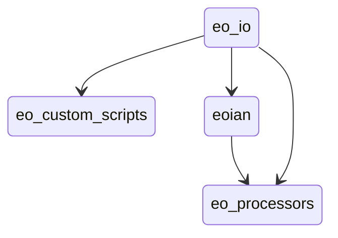

# The ECHOES Earth Observation Processing Service

This is the high-level documentation for the ECHOES Project code.

To view this documentation in a browser, install [docsify](https://docsify.js.org/), cd to the eo-docs directory, and
enter the command:

    docsify serve

## Introduction

The ECHOES Earth Observation (EO) Processing Service has been developed to
generate GeoTIFFs and associated metadata, which are consumed by the web service.
It is designed to run in the cloud.
The EO service can consume data from the Sentinel-Hub API or alternatively, 
satellite data stored on and object store on CREODIAS, or other compatible cloud services. 

The EO service is decoupled for the web service and can be used independently of it.
It is containerised for portability and scalability. 
It is extendable, allowing further EO processors to be easily added.     

The EO service provides CLI for calling the EO processors. 
The results (images, metadata, etc.) are stored in an S3 compatible object store.
These are accessed by the EHCOES UI component for display to users. 
The EO service does not do the scheduling; this is done by eo-ruuner. 

The processing chains have been developed to run in the cloud. 
Advantages of using cloud services, such as Creodias and AWS, include:
* they can take advantage of the satellite data available there
* the size of the VMs can be increased or decreased as required

## The EO Processing Packages

The following Python packages are used for EO processing in ECHOES:
* [eo-io](https://github.com/ECHOESProj/eo-io) is used to interface to the S3 object store.
It is a lower level module, used by the other packages,
to write the GeoTIFFs and metadata to S3.

* [eo-custom-scripts](https://github.com/ECHOESProj/eo-custom-scripts) uses the Sentinel-Hub API to generate products.

* [eoian](https://github.com/ECHOESProj/eoian]) is used to process satellite data for the store (e.g. in the SAFE format for Sentinel-2 data).

* [eo-processors](https://github.com/ECHOESProj/eo-processors) contains the processors.

With eo-custom-scripts, the processing is done on Sentinel-Hub's servers, whereas with eoian the processing is done locally. 
Therefore, the machine requirements may be greater for the eoian processing chain, depending on the processing.

eo-processors and eo-custom-scripts can each be called by a CLI interface or imported as a Python module. See the README of
[eo-processors](https://github.com/ECHOESProj/eo-processors) and [eo-custom-scripts](https://github.com/ECHOESProj/eo-custom-scripts)
for information on their installation and usage. 
The dependancy of the modules is shown in the following diagram:

## [eo-custom-scripts](https://github.com/ECHOESProj/eo-custom-scripts)

[Sentinel Hub](https://www.sentinel-hub.com/) is a multi-spectral and multi-temporal big data satellite imagery service.
Users can use APIs to retrieve satellite data over their AOI and specific time range from full archives in a matter of
seconds.

[//]: # (An additional benefit of using Sentinel Hub is that the EO data can be accessed as a data cube using X-Cube. Data cubes)

[//]: # (provide convenient access to a time series of satellite images, allowing computations across the time dimension, with)

[//]: # (raster alignment issues handled out of the box. Data cubes will be used to provide information about changes over time)

[//]: # (and space on the ECHOES platform. The Euro Data Cube &#40;EDC&#41; service [#Todo ref] is used to provide access data cubes. EDC)

[//]: # (provides hosted Jupyter Notebooks for analysing EO data using Sentinel Hub and X-Cube. EDC is used for convenience and)

[//]: # (is not required to access the data cubes, as X-Cube can be called directly.)

The figure below shows a chain block diagram for the eo-mosaics processing chain, which generates GeoTIFFs using Sentinel-Hub. 
The diagram shows the code running on a VM on CREODIAS; however, it is not limited to CREODIAS,
and cloud, for example, run on AWS. 
To run on other cloud platforms, the credentials' file needs to be modified (see [Handling the credentials](#handling-the-credentials]). 

An S3, compatible object store is required, 
but if one is not available Minio can be used (see [Object Storage](#object-storage)). 
The code calls the Sentinel Hub API. The algorithm is implemented in JavaScript.

The code in the [Sentinel-Hub Customs Scripts repository](https://github.com/sentinel-hub/custom-scripts), has been
added to the eo-mosaics repository, so that the script can called via the command line. This enables many EO products
can be quickly implemented on the ECHOES platform.

## [eoian](https://github.com/ECHOESProj/eoian) (todo)

## [eo-processors](https://github.com/ECHOESProj/eo-processors) (todo)

## [eo-io](https://github.com/ECHOESProj/eo-io)

The results of the EO processing (e.g. GeoTiffs) are stored in an object store. A third Python
package, [eo-io](https://github.com/ECHOESProj/eo-io), is used
by [eo-custom-scripts](https://github.com/ECHOESProj/eo-custom-scripts)
and [eoian](https://github.com/ECHOESProj/eoian]) to store the results in S3. S3 is available on AWS and an S3
compatible object store is available on CREODIAS. When running locally, [Minio](https://min.io/) can be used to provide
an S3 compatible, locally hosted, object store.

## [websockets-server](https://github.com/ECHOESProj/websockets-server) (todo)

## The Development Environment & Deployment

Development of the EO processing chain can be done on a local or machine or a remote VM,
hosted by, for example, CREODIAS or AWS.

The setup of the EO dev environment can be time-consuming. It involves the following sets:
* install system packages
* install Python requirements
* copy keys over
* decrypt and copy credentials over
* set environment variables
* install Docker
* build Docker images
* Install JupyterLab
    
### Docker containers

Both eo-custom-scripts and eo-processors are containerised. 
It is therefore a matter of building the containers, as described in the README of these packages. 
To get the EO service up and running, we also need to build and run the websockets-server image and
eo-stack, in addition to handling the credentials.
Docker ensures that the code runs uniformly and consistently on the host machine or container service.

### GitHub credentials

SSH deploy keys are used to access the code on the VM. 
[The keys are located in the eo-playbooks repo](https://github.com/ECHOESProj/eo-playbooks/tree/main/roles/common/files).

### Jupyter Lab

JupyterLab is used to prototype EO processors, before being added to the processing chain.  

## Automation of the dev environment using Ansible

Ansible is used to automate the setup of the development machines. The ansible playbooks are in
the [eo-playbooks](https://github.com/ECHOESProj/eo-playbooks) repo. See the README in the repo for the installation and
usage instructions.

### Handling the credentials

The credentials are stored in yaml files in the eo-playbooks repository and are encrypted and the key to decrypt them is
stored in the Compass account LastPass under Shared-ECHOES/eo-playbooks. The playbook is executed with the "--ask-pass"
option, which prompts for the password. The credentials will be copied over to the remote machine and unencrypted. The
credentials are stored in the eo-playbooks repo under:

* roles/servers_creodias/files/config_eo_service.yml (the credentials for CREODAS)
* roles/servers_no_s3/files/config_eo_service.yml (the credentials for a local machine, or one without S3 storage)
* roles/common/files/id_rsa (the [GitHub ssh key](https://docs.github.com/en/authentication/connecting-to-github-with-ssh/generating-a-new-ssh-key-and-adding-it-to-the-ssh-agent)). TODO: update this

If you want to use the code without using Ansible, you will need to decrypt the configuration
files and copy the config files to the required directory (as described below).
[See here for instructions on decrypting encrypted files.](https://docs.ansible.com/ansible/latest/user_guide/vault.html#decrypting-encrypted-files)

Put the appropriate config_eo_service.yml configuration file in the user's home directory.

To run the code using Docker, copy the config files and GitHub key to the credentials directory, for example,
eo-custom-scripts\credentials. This is required because Docker cannot access files outside it's scope when building the
image. The files in the credentials' directory are copied to the home directory in the container.

It is not necessary to carry out these steps manually if you use Ansible. However, if you are doing them manually, refer
to the following Ansible roles in the eo-playbooks repo:

* roles/common/tasks/main.yml
* roles/servers_creodias/tasks/main.yml
* roles/servers_no_s3/tasks/main.yml

for the steps involved in decrypting and copying the credentials across.
          
## Usage (Using Docker) 
 
After the development machine has been provisioned (see [eo-playbooks](https://github.com/ECHOESProj/eo-playbooks)),
login into the terminal and list the container images available, as follows:

    vagrant@ubuntu-focal:~$ docker image list
    REPOSITORY          TAG            IMAGE ID       CREATED         SIZE
    eo-processors       latest         8bd2b6719048   2 days ago      1.99GB
    eo-custom-scripts   latest         9fb59b602664   2 days ago      1.44GB
    websockets-server   latest         5ea2a8fbc8fd   2 days ago      408MB

Both eo-processors and eo-custom-scripts provide CLIs with which to run the processing, as shown in the following examples: 

    docker run --env-file=/home/eouser/env_file eo-custom-scripts copernicus_services global_surface_water_change "POLYGON((-6.3777351379394 52.344188690186, -6.3780784606933 52.357234954835, -6.3552474975585 52.357749938966, -6.3561058044433 52.345218658448, -6.3777351379394 52.344188690186))" 2015-01-01 2020-12-31
    docker run --env-file=/home/eouser/env_file eo-processors ndvi_satpy S2_MSI_L1C "POLYGON((-6.485367 52.328206, -6.326752 52.328206, -6.326752 52.416241, -6.485367 52.416241, -6.485367 52.328206))" 2021-01-09 2021-02-01 --cloud_cover=90

Alternatively, the VM has the following alias:

    alias eo-run='docker run --env-file=/home/eouser/env_file -v /data:/data --network host'

which can the used call the container with the environment file automatically passed:

    eo-run eo-processors change_detection_s2_pca "POLYGON ((-6.485367 52.328206, -6.326752 52.328206, -6.326752 52.416241, -6.485367 52.416241, -6.485367 52.328206))" 2021-01-09 2021-02-01
                                                                                                                       
See the README in these repositories for usage instructions.
 
## Jupyter Lab

Add this to local .bashrc:

    ssh -i ~/.ssh/eo-stack.key -N -L 8888:localhost:8888 eouser@<ip-of-remote-server> &

Go to:

    http://127.0.0.1:8888

